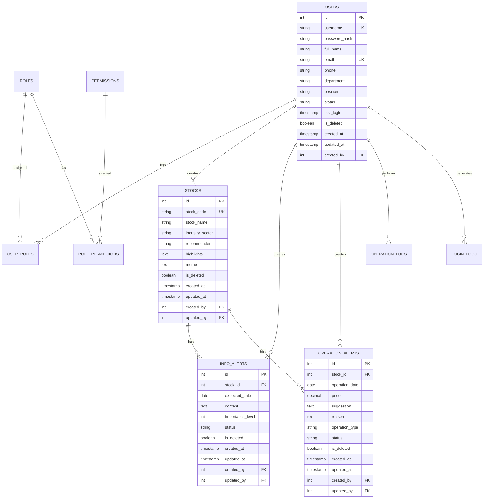

# 数据库架构设计文档

## 概述

本文档描述了股票管理系统的数据库架构设计。系统采用关系型数据库设计，支持股票信息管理、提示信息管理、用户权限管理等核心功能。数据库设计遵循第三范式，确保数据一致性和查询效率。

## 架构

### 数据库选择
- **主数据库**: SQLite (开发环境) / PostgreSQL (生产环境)
- **ORM框架**: SQLAlchemy (Flask集成)
- **连接池**: SQLAlchemy连接池管理
- **事务管理**: 支持ACID事务特性

### 架构原则
- 遵循第三范式减少数据冗余
- 使用外键约束保证数据完整性
- 在高频查询字段建立索引
- 支持软删除保留历史数据
- 记录完整的审计日志

## 组件和接口

### 核心数据表

#### 1. 股票信息表 (stocks)
```sql
CREATE TABLE stocks (
    id INTEGER PRIMARY KEY AUTOINCREMENT,
    stock_code VARCHAR(10) UNIQUE NOT NULL,           -- 股票代码
    stock_name VARCHAR(100) NOT NULL,                 -- 股票名称
    industry_sector VARCHAR(50),                      -- 行业板块
    recommender VARCHAR(50),                          -- 股票推荐人
    highlights TEXT,                                  -- 股票亮点
    memo TEXT,                                        -- 其他信息备忘
    is_deleted BOOLEAN DEFAULT FALSE,                 -- 软删除标记
    created_at TIMESTAMP DEFAULT CURRENT_TIMESTAMP,   -- 创建时间
    updated_at TIMESTAMP DEFAULT CURRENT_TIMESTAMP,   -- 更新时间
    created_by INTEGER,                               -- 创建人ID
    updated_by INTEGER,                               -- 更新人ID
    FOREIGN KEY (created_by) REFERENCES users(id),
    FOREIGN KEY (updated_by) REFERENCES users(id)
);

-- 索引
CREATE INDEX idx_stocks_code ON stocks(stock_code);
CREATE INDEX idx_stocks_name ON stocks(stock_name);
CREATE INDEX idx_stocks_sector ON stocks(industry_sector);
CREATE INDEX idx_stocks_recommender ON stocks(recommender);
```

#### 2. 信息发布提示表 (info_alerts)
```sql
CREATE TABLE info_alerts (
    id INTEGER PRIMARY KEY AUTOINCREMENT,
    stock_id INTEGER NOT NULL,                        -- 关联股票ID
    expected_date DATE NOT NULL,                      -- 预计日期
    content TEXT NOT NULL,                            -- 公布内容
    importance_level INTEGER DEFAULT 1,               -- 重要程度 (1-5)
    status VARCHAR(20) DEFAULT 'pending',             -- 状态: pending, completed, expired
    is_deleted BOOLEAN DEFAULT FALSE,
    created_at TIMESTAMP DEFAULT CURRENT_TIMESTAMP,
    updated_at TIMESTAMP DEFAULT CURRENT_TIMESTAMP,
    created_by INTEGER,
    updated_by INTEGER,
    FOREIGN KEY (stock_id) REFERENCES stocks(id),
    FOREIGN KEY (created_by) REFERENCES users(id),
    FOREIGN KEY (updated_by) REFERENCES users(id)
);

-- 索引
CREATE INDEX idx_info_alerts_stock ON info_alerts(stock_id);
CREATE INDEX idx_info_alerts_date ON info_alerts(expected_date);
CREATE INDEX idx_info_alerts_importance ON info_alerts(importance_level);
CREATE INDEX idx_info_alerts_status ON info_alerts(status);
```

#### 3. 操作提示表 (operation_alerts)
```sql
CREATE TABLE operation_alerts (
    id INTEGER PRIMARY KEY AUTOINCREMENT,
    stock_id INTEGER NOT NULL,                        -- 关联股票ID
    operation_date DATE NOT NULL,                     -- 操作日期
    price DECIMAL(10,2),                              -- 价格
    suggestion TEXT NOT NULL,                         -- 建议
    reason TEXT,                                      -- 理由
    operation_type VARCHAR(20),                       -- 操作类型: buy, sell, hold
    status VARCHAR(20) DEFAULT 'active',              -- 状态: active, executed, cancelled
    is_deleted BOOLEAN DEFAULT FALSE,
    created_at TIMESTAMP DEFAULT CURRENT_TIMESTAMP,
    updated_at TIMESTAMP DEFAULT CURRENT_TIMESTAMP,
    created_by INTEGER,
    updated_by INTEGER,
    FOREIGN KEY (stock_id) REFERENCES stocks(id),
    FOREIGN KEY (created_by) REFERENCES users(id),
    FOREIGN KEY (updated_by) REFERENCES users(id)
);

-- 索引
CREATE INDEX idx_operation_alerts_stock ON operation_alerts(stock_id);
CREATE INDEX idx_operation_alerts_date ON operation_alerts(operation_date);
CREATE INDEX idx_operation_alerts_type ON operation_alerts(operation_type);
```

#### 4. 用户表 (users)
```sql
CREATE TABLE users (
    id INTEGER PRIMARY KEY AUTOINCREMENT,
    username VARCHAR(50) UNIQUE NOT NULL,             -- 用户名
    password_hash VARCHAR(255) NOT NULL,              -- 密码哈希
    full_name VARCHAR(100) NOT NULL,                  -- 姓名
    email VARCHAR(100) UNIQUE,                        -- 邮箱
    phone VARCHAR(20),                                -- 手机
    department VARCHAR(50),                           -- 部门
    position VARCHAR(50),                             -- 职位
    status VARCHAR(20) DEFAULT 'active',              -- 状态: active, inactive, locked
    last_login TIMESTAMP,                             -- 最后登录时间
    is_deleted BOOLEAN DEFAULT FALSE,
    created_at TIMESTAMP DEFAULT CURRENT_TIMESTAMP,
    updated_at TIMESTAMP DEFAULT CURRENT_TIMESTAMP,
    created_by INTEGER,
    FOREIGN KEY (created_by) REFERENCES users(id)
);

-- 索引
CREATE INDEX idx_users_username ON users(username);
CREATE INDEX idx_users_email ON users(email);
CREATE INDEX idx_users_status ON users(status);
```

#### 5. 角色表 (roles)
```sql
CREATE TABLE roles (
    id INTEGER PRIMARY KEY AUTOINCREMENT,
    role_name VARCHAR(50) UNIQUE NOT NULL,            -- 角色名称
    role_code VARCHAR(20) UNIQUE NOT NULL,            -- 角色代码
    description TEXT,                                 -- 角色描述
    is_system BOOLEAN DEFAULT FALSE,                  -- 是否系统角色
    is_deleted BOOLEAN DEFAULT FALSE,
    created_at TIMESTAMP DEFAULT CURRENT_TIMESTAMP,
    updated_at TIMESTAMP DEFAULT CURRENT_TIMESTAMP
);

-- 预设角色数据
INSERT INTO roles (role_name, role_code, description, is_system) VALUES
('超级管理员', 'SUPER_ADMIN', '系统最高权限管理员', TRUE),
('系统管理员', 'SYS_ADMIN', '系统管理和配置权限', TRUE),
('股票管理员', 'STOCK_ADMIN', '股票信息管理权限', TRUE),
('操作员', 'OPERATOR', '日常操作权限', TRUE),
('只读用户', 'READONLY', '只读查看权限', TRUE);
```

#### 6. 用户角色关联表 (user_roles)
```sql
CREATE TABLE user_roles (
    id INTEGER PRIMARY KEY AUTOINCREMENT,
    user_id INTEGER NOT NULL,
    role_id INTEGER NOT NULL,
    assigned_at TIMESTAMP DEFAULT CURRENT_TIMESTAMP,
    assigned_by INTEGER,
    FOREIGN KEY (user_id) REFERENCES users(id),
    FOREIGN KEY (role_id) REFERENCES roles(id),
    FOREIGN KEY (assigned_by) REFERENCES users(id),
    UNIQUE(user_id, role_id)
);

-- 索引
CREATE INDEX idx_user_roles_user ON user_roles(user_id);
CREATE INDEX idx_user_roles_role ON user_roles(role_id);
```

#### 7. 权限表 (permissions)
```sql
CREATE TABLE permissions (
    id INTEGER PRIMARY KEY AUTOINCREMENT,
    permission_name VARCHAR(100) NOT NULL,            -- 权限名称
    permission_code VARCHAR(50) UNIQUE NOT NULL,      -- 权限代码
    module VARCHAR(50) NOT NULL,                      -- 所属模块
    description TEXT,                                 -- 权限描述
    is_deleted BOOLEAN DEFAULT FALSE,
    created_at TIMESTAMP DEFAULT CURRENT_TIMESTAMP
);
```

#### 8. 角色权限关联表 (role_permissions)
```sql
CREATE TABLE role_permissions (
    id INTEGER PRIMARY KEY AUTOINCREMENT,
    role_id INTEGER NOT NULL,
    permission_id INTEGER NOT NULL,
    granted_at TIMESTAMP DEFAULT CURRENT_TIMESTAMP,
    FOREIGN KEY (role_id) REFERENCES roles(id),
    FOREIGN KEY (permission_id) REFERENCES permissions(id),
    UNIQUE(role_id, permission_id)
);
```

#### 9. 操作日志表 (operation_logs)
```sql
CREATE TABLE operation_logs (
    id INTEGER PRIMARY KEY AUTOINCREMENT,
    user_id INTEGER,                                  -- 操作用户ID
    operation_type VARCHAR(50) NOT NULL,             -- 操作类型
    module VARCHAR(50) NOT NULL,                     -- 操作模块
    target_type VARCHAR(50),                         -- 目标类型
    target_id INTEGER,                               -- 目标ID
    operation_desc TEXT,                             -- 操作描述
    ip_address VARCHAR(45),                          -- IP地址
    user_agent TEXT,                                 -- 用户代理
    request_data TEXT,                               -- 请求数据
    response_data TEXT,                              -- 响应数据
    status VARCHAR(20) DEFAULT 'success',            -- 操作状态
    created_at TIMESTAMP DEFAULT CURRENT_TIMESTAMP,
    FOREIGN KEY (user_id) REFERENCES users(id)
);

-- 索引
CREATE INDEX idx_operation_logs_user ON operation_logs(user_id);
CREATE INDEX idx_operation_logs_type ON operation_logs(operation_type);
CREATE INDEX idx_operation_logs_module ON operation_logs(module);
CREATE INDEX idx_operation_logs_date ON operation_logs(created_at);
```

#### 10. 登录日志表 (login_logs)
```sql
CREATE TABLE login_logs (
    id INTEGER PRIMARY KEY AUTOINCREMENT,
    user_id INTEGER,
    username VARCHAR(50),                             -- 登录用户名
    login_type VARCHAR(20) DEFAULT 'normal',          -- 登录类型
    ip_address VARCHAR(45),                          -- IP地址
    user_agent TEXT,                                 -- 用户代理
    login_status VARCHAR(20) NOT NULL,               -- 登录状态: success, failed
    failure_reason VARCHAR(100),                     -- 失败原因
    session_id VARCHAR(100),                         -- 会话ID
    login_time TIMESTAMP DEFAULT CURRENT_TIMESTAMP,
    logout_time TIMESTAMP,
    FOREIGN KEY (user_id) REFERENCES users(id)
);

-- 索引
CREATE INDEX idx_login_logs_user ON login_logs(user_id);
CREATE INDEX idx_login_logs_time ON login_logs(login_time);
CREATE INDEX idx_login_logs_status ON login_logs(login_status);
```

## 数据模型

### 实体关系图



### 数据字典

#### 枚举值定义

**用户状态 (user.status)**
- `active`: 活跃用户
- `inactive`: 非活跃用户
- `locked`: 锁定用户

**提示状态 (alerts.status)**
- `pending`: 待处理
- `completed`: 已完成
- `expired`: 已过期
- `cancelled`: 已取消

**操作类型 (operation_alerts.operation_type)**
- `buy`: 买入建议
- `sell`: 卖出建议
- `hold`: 持有建议

**重要程度 (info_alerts.importance_level)**
- `1`: 一般
- `2`: 重要
- `3`: 紧急
- `4`: 非常紧急
- `5`: 最高优先级

## 错误处理

### 数据完整性约束
- 主键约束确保记录唯一性
- 外键约束确保关联数据一致性
- 唯一约束防止重复数据
- 非空约束确保必要字段完整

### 错误处理策略
- 数据库连接失败时的重试机制
- 事务回滚确保数据一致性
- 约束违反时的友好错误提示
- 批量操作的部分失败处理

### 数据验证
- 股票代码格式验证
- 邮箱格式验证
- 手机号格式验证
- 日期范围验证

## 测试策略

### 数据库测试
- **单元测试**: 测试每个表的CRUD操作
- **集成测试**: 测试表间关联查询
- **性能测试**: 测试大数据量下的查询性能
- **约束测试**: 测试各种约束条件

### 测试数据
- 创建测试数据集用于开发和测试
- 模拟真实业务场景的数据
- 边界值和异常数据测试
- 性能测试的大数据集

### 迁移测试
- 数据库版本升级测试
- 数据迁移完整性验证
- 回滚机制测试
- 生产环境迁移演练